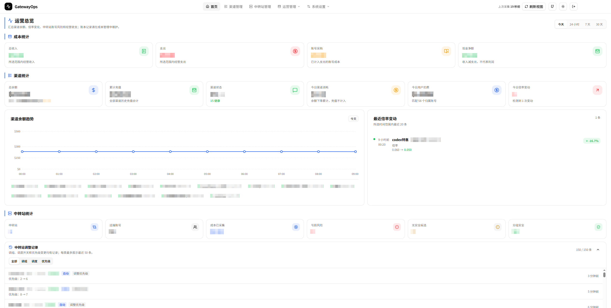
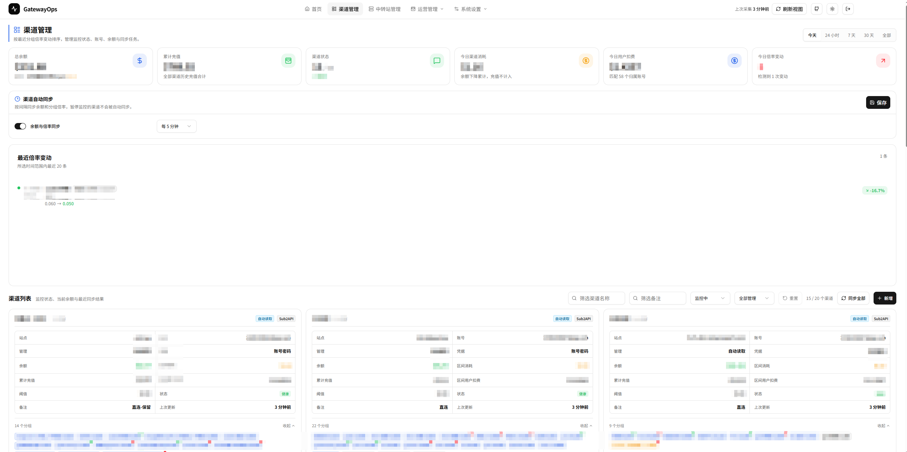
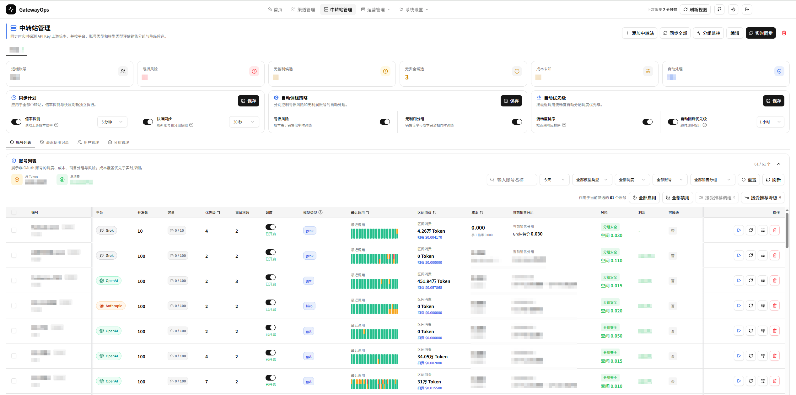
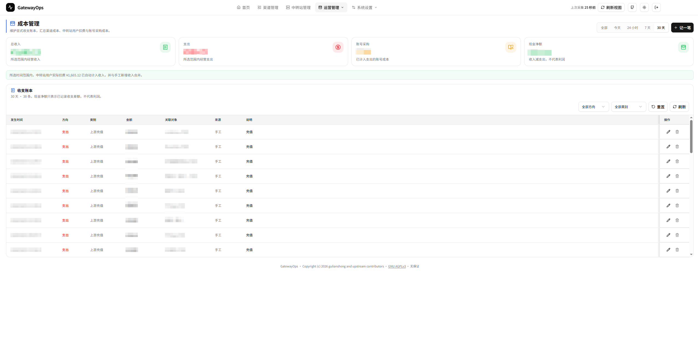
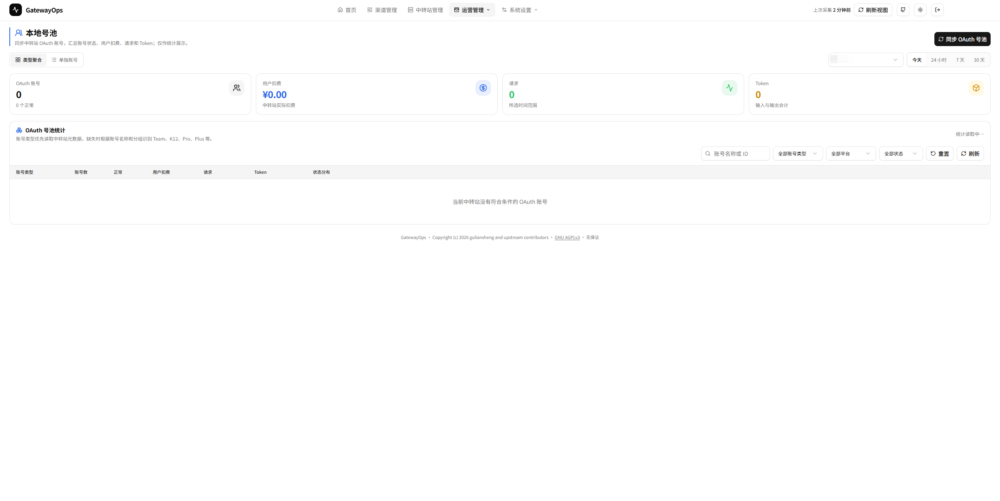
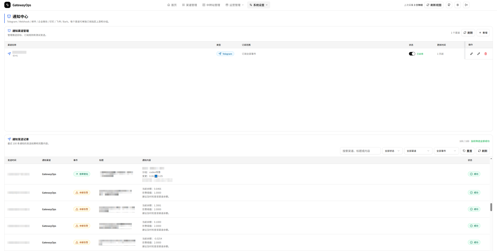
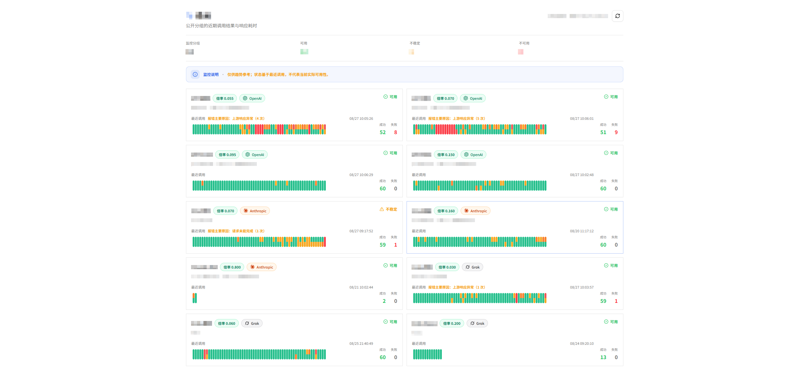

# GatewayOps

GatewayOps 是一个面向 **NewAPI / Sub2API 生态**的自托管运营管理平台，用于集中处理渠道健康监控、倍率与成本分析、Sub2API 中转站运营、通知、收支账本和 OAuth 号池统计。

项目采用 Go 后端与 React 前端。生产镜像会把前端资源嵌入 Go 二进制，部署时只需要 GatewayOps 应用和 PostgreSQL 数据库。

> GatewayOps 是运营与监控中枢，不替代 NewAPI 或 Sub2API。中转站管理功能依赖 Sub2API 管理 API。

## 功能概览

### 渠道管理

- 管理 NewAPI 和 Sub2API 渠道。
- 支持账号密码与 Token 两种凭据模式。
- 登录测试、启用/停用、余额刷新、倍率刷新和完整同步。
- 自动读取余额和分组倍率，也可手工维护余额、分组与倍率。
- 设置余额阈值和监控开关，查看余额历史、倍率变化与监控日志。
- 支持一个渠道下维护多个账号。
- 支持 Turnstile，可配置 CapSolver、2Captcha、Anti-Captcha 和 YesCaptcha。

### 运营总览

首页提供今天、24 小时、7 天和 30 天视图，集中展示渠道余额、低余额渠道、倍率变化、中转站与账号风险、成本采集情况、自动调整记录以及收入支出汇总。

### Sub2API 中转站管理

添加 Sub2API 地址和管理员 API Key 后，可以：

- 同步账号、分组、渠道、用户和关联关系快照。
- 分开配置快照同步与倍率探测计划。
- 读取 API Key 的上游成本倍率，用于成本统计、利润判断和风险识别。
- 管理公开/专属分组、倍率、平台、模型类型、排序和监控状态。
- 管理账号分组、模型类型、并发、优先级、调度状态和池模式重试次数。
- 执行账号连接测试、分组快速测试和批量配置。
- 通过关联渠道分组、手工倍率或自动关联覆盖账号成本。
- 根据成本、销售倍率、平台、账号类型和模型类型生成调组建议。
- 可选启用自动调组、无盈利账号处理、自动优先级和优先级回调。
- 保存手动及自动调整的审计记录。

账号风险状态包括：未启用、成本未知、未分配销售组、分组安全、无盈利候选、无安全候选和亏损风险。

> NewAPI 可用于渠道监控，但当前“中转站管理”只适配 Sub2API 管理 API。

### 公开分组调用监控

为公开分组开启监控后，可以分享无需后台登录的监控页面：

```text
/public/relay-monitor/<中转站 ID>
```

页面展示公开分组的近期调用结果、响应耗时、倍率和可用性趋势。状态来自最近调用记录，仅供趋势参考，不代表实时可用性。

### 成本管理

- 记录用户收入、其他收入、运营支出和其他支出。
- 账本记录可关联渠道、中转站或本地账号。
- 按时间范围汇总收入、支出、现金净额和各类成本。
- 自动汇总中转站用户实际扣费。
- 本地账号采购成本可自动生成支出记录。

账本净额表示已记录的现金收支差额，不直接等同于利润。

### 本地 OAuth 号池

- 从中转站同步 OAuth 账号和使用统计。
- 按账号类型、平台、状态和关键字筛选。
- 查看正常、未调度和异常账号数量。
- 汇总用户扣费、请求次数、Token 数和状态分布。
- 登记本地账号的采购成本、预计额度、有效期和备注。
- 自动关联本地账号与远端中转站账号。

### 通知与验证码

支持 Telegram、Webhook、SMTP 邮件、企业微信、钉钉、飞书和 Bark。通知事件包括余额不足、倍率变化、登录失败、验证码失败和监控失败，可按渠道和分组过滤，并支持消息合并、变化幅度过滤、低余额冷却和失败重试。

验证码服务用于维护和测试 Turnstile 打码 Provider，测试通过后可绑定到渠道。

## 页面与路由

| 页面 | 路由 | 用途 |
| --- | --- | --- |
| 运营总览 | `/` | 查看渠道、中转站和经营数据总览 |
| 渠道管理 | `/channels` | 管理渠道、余额、倍率和同步任务 |
| 中转站管理 | `/relay-stations` | 管理 Sub2API 中转站、账号、分组和用户 |
| 成本管理 | `/operations/costs` | 维护收支账本与成本汇总 |
| 本地号池 | `/operations/local-pool` | 查看 OAuth 号池和本地账号统计 |
| 验证码服务 | `/captcha` | 配置并测试 Turnstile 打码服务 |
| 通知渠道 | `/notifications` | 配置通知方式、订阅规则和发送测试 |
| 公开分组监控 | `/public/relay-monitor/:stationID` | 分享公开分组调用监控 |

## Docker Compose 部署

### 1. 准备配置

```bash
cp .env.example .env
```

至少修改：

```env
GATEWAYOPS_DATABASE_PASSWORD=替换为数据库密码
APP_SECRET=替换为至少32字节的随机字符串
```

`APP_SECRET` 用于加密渠道凭据、通知配置和中转站管理员 API Key。请长期保存；更换或丢失后，已有敏感数据将无法解密。

公网部署必须开启后台登录：

```env
AUTH_ENABLED=true
ADMIN_USERNAME=admin
ADMIN_PASSWORD=替换为强密码
```

### 2. 准备 Sub2API 共享网络

当前 Compose 默认加入 Sub2API 的外部网络。如果网络不存在，先创建：

```bash
docker network create sub2api-deploy_sub2api-network
```

如果 Sub2API 不在同一 Docker 主机上，可以按实际网络环境修改 `docker-compose.yml`，移除或替换该外部网络。

### 3. 启动服务

```bash
docker compose up -d --build
```

默认访问地址：<http://127.0.0.1:8080>

检查健康状态：

```bash
curl http://127.0.0.1:8080/healthz
```

正常响应：

```json
{"status":"ok"}
```

### 常用命令

```bash
docker compose ps
docker compose logs -f app
docker compose pull
docker compose up -d --build app
docker compose stop
docker compose down
```

PostgreSQL 数据保存在 `gatewayops-postgres-data` volume 中。不要在没有备份的情况下删除该 volume。

## 关键环境变量

完整示例见 [.env.example](./.env.example) 和 [backend/config.example.yaml](./backend/config.example.yaml)。

| 变量 | 默认值 | 说明 |
| --- | --- | --- |
| `GATEWAYOPS_DATABASE_USER` | `gatewayops` | PostgreSQL 用户 |
| `GATEWAYOPS_DATABASE_PASSWORD` | 无 | PostgreSQL 密码，必填 |
| `GATEWAYOPS_DATABASE_NAME` | `gatewayops` | 数据库名称 |
| `GATEWAYOPS_POSTGRES_PORT` | `54329` | 宿主机数据库映射端口 |
| `GATEWAYOPS_HTTP_PORT` | `8080` | 宿主机 Web 端口 |
| `GATEWAYOPS_IMAGE_TAG` | `latest` | Docker Hub 镜像标签 |
| `GATEWAYOPS_SERVER_MODE` | `release` | 后端运行模式 |
| `GATEWAYOPS_LOG_LEVEL` | `info` | 日志等级 |
| `APP_SECRET` | 无 | 敏感数据加密主密钥，必填 |
| `AUTH_ENABLED` | `false` | 是否开启后台登录 |
| `ADMIN_USERNAME` | `admin` | 后台管理员账号 |
| `ADMIN_PASSWORD` | 空 | 后台管理员密码 |
| `AUTH_TOKEN_SECRET` | 空 | Token 密钥，空时使用 `APP_SECRET` |
| `GATEWAYOPS_HTTP_PROXY` | 空 | 应用访问公网时使用的 HTTP 代理 |
| `GATEWAYOPS_HTTPS_PROXY` | 空 | 应用访问公网时使用的 HTTPS 代理 |
| `GATEWAYOPS_NO_PROXY` | 内置默认值 | 不使用代理的地址列表 |

## 同步与后台任务

- 渠道余额监控默认每 15 分钟执行。
- 渠道倍率监控默认每 30 分钟执行。
- 渠道自动同步可在渠道管理页面启用并设置间隔。
- 中转站快照同步与倍率探测在中转站管理页面分别配置。
- 快照同步只更新账号、分组和关联关系，不执行倍率探测。
- 默认每天清理过期监控日志、余额快照和通知日志；倍率变化记录长期保留。

## 首次使用

1. 在“渠道管理”添加 NewAPI 或 Sub2API 渠道。
2. 根据站点选择账号密码或 Token 凭据模式。
3. 测试登录，再执行完整同步，确认余额和倍率正常。
4. 如站点启用了 Turnstile，先在“验证码服务”创建并测试 Provider。
5. 在“通知渠道”配置通知方式和订阅规则。
6. 如需中转站运营，添加 Sub2API 地址和管理员 API Key，然后执行实时同步。
7. 检查成本倍率和风险建议后，再决定是否开启自动调组或自动优先级。

## 从源码运行

前端：

```bash
cd frontend
pnpm install
pnpm dev
```

后端：

```bash
cd backend
go mod download
go run ./cmd/server
```

前端默认运行在 <http://localhost:3010>，并将 `/api` 和 `/healthz` 代理到 `http://localhost:8418`。后端默认监听 `8418`。开发期需要同时运行两者，并准备 PostgreSQL 及必要环境变量。

构建一体化镜像：

```bash
docker build -t gateway-ops:dev .
```

## 安全与数据

- 同时备份 `APP_SECRET` 和 PostgreSQL 数据。
- `AUTH_ENABLED=false` 只适合纯内网或已有反向代理鉴权的环境。
- 中转站管理员 API Key 只在后端加密保存，不返回前端。
- 渠道密码、Token、Cookie、通知密钥和 Webhook 等敏感配置均加密保存。
- 公开监控页面只展示已开启公开监控的分组，不提供管理能力。
- 删除中转站会删除本地账号、分组、渠道快照和调整配置，但保留历史运营账本记录。
- PostgreSQL 端口默认仅绑定 `127.0.0.1`。

## 技术架构

- **Backend**：Go 1.23、Gin、GORM、PostgreSQL、robfig/cron。
- **Frontend**：React 19、TypeScript、Vite、Tailwind CSS、Radix UI、Recharts。
- **连接器**：NewAPI 与 Sub2API 登录、鉴权、余额、倍率和管理 API 适配。
- **构建**：前端构建、Go 编译、Alpine 运行时三阶段 Docker 构建。
- **部署**：前端资源嵌入 Go 二进制，由单个应用容器同时提供页面与 API。
- **镜像**：发布到 Docker Hub `gls/gateway-ops`，支持 `latest`、`edge`、版本号和 commit SHA 标签。

## License

GatewayOps 使用 [GNU Affero General Public License v3.0](./LICENSE) 发布。

本项目基于 MIT 许可的上游项目 `worryzyy/upstream-hub` 修改而来。上游版权和许可证文本保留在 [LICENSES/MIT-upstream.txt](./LICENSES/MIT-upstream.txt)，修改与署名信息见 [NOTICE.md](./NOTICE.md)。

## 页面截图














